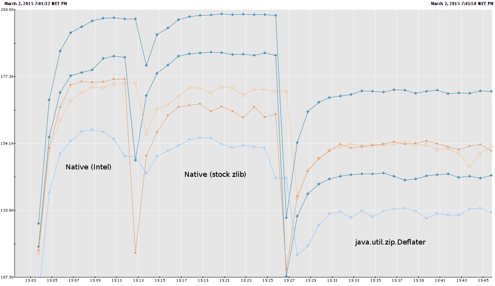

# KaBoom - libNativeDeflate, what's this all about?

KaBoom 0.7.3 introduced offloading compression to a native system shared object.  Earlier versions used Java's java.util.zip.Deflater to compress the Avro boom files.  This deflation was the most expensive operation that KaBoom performs and has a large impact on performance.

The above shows roughly a 28% increase in performance when the deflate alrorithm is implemented in C, as opposed to Java.  

## Features
* Uses the [Curator Framework](http://curator.apache.org/) for  [Apache Zookeeper](zookeeper.apache.org) to distribute work amongst multiple servers
* Supports writing to secured Hadoop clusters via Kerberos based secure impersonation (conveniently pulled from [Flume](http://flume.apache.org/))
* Recovers from Kafka server failures (even when newly elected leaders weren't in-sync when elected)
* Supports consuming with either GZIP or Snappy compression
* Configurable: Each topic can be configured with a unique HDFS path template with date/time variable substitution
* Supports flagging timestamp template HDFS directories as 'Ready' when all a topic's partition's messages have been written for a given hour

## Author(s)
* [Dave Ariens](<mailto:dariens@blackberry.com>) (current maintainer)

## Building

## Configuring
